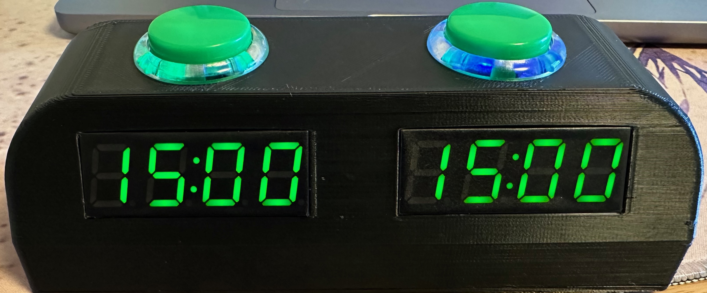
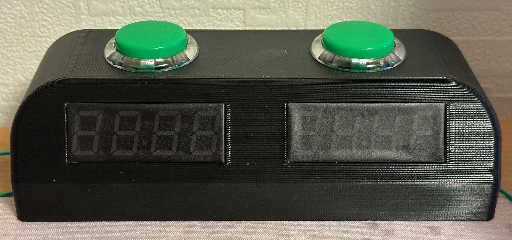

# Chess-Clock

### ESP8266 powered Chess Clock.

#### Overview
Software is basic but functional. Mode button on the back to set the amount of time allocated to each player, and a brightness button on the back to set the brightness of the 7-segment displays.

Once the desired game time has been selected, hit either of the player buttons on the top of the clock to start the other players time counting down. If any player reaches zero seconds, their display flashes and a tone is sounded from the internal buzzer.

Pressing any player button when in 'game over' mode will reset the game. If the game is completed before the timer runs out, the only way to start a new game is to turn it off and back on. I'll probably add a reset function caused by pressing both player buttons at the same time, or some similar action.

#### Construction
The STL files are provided, I printed in PLA with 3 perimeters, 0.4mm nozzle, no supports. The print orientation of the files is correct. No supports are needed. There is a sacrificial bridge for the player button holes. Cut the hole clear with a sharp knife when print is finished.

Any ESP can probably be used, I had some ESP-12 modules laying around so I used that. All available IO is occupied, so there is no serial logging in the sketch, as the UART pins are being used for buttons.

Solder everything up according to the pin definitions in the sketch.

#### Parts
These links will probably not last, but these are most of the parts I used:

* **Play buttons:** https://www.aliexpress.com/item/32651573107.html (Arcade Push Button 30MM 24MM Game Switch Have Click Sound Microswitch PC /PS3 USB Joystick DIY SANWA OBSF Copy Replace)
* **mode & power buttons:** Standard 5mm tacswitch. Shorter one for the power button to avoid accidental presses.
* **Displays:** https://www.aliexpress.com/item/1005002059351703.html (TM1637 LED Display Module for Arduino 4 Digit 7 Segment 0.56 inch Time Clock Indicator Tube Module Red Blue Green Yellow White)
* **Battery charge unit:** https://www.aliexpress.com/item/1005003340733366.html (Type-C USB 5V 2A Boost Converter Step-Up Power Module Lithium Battery Charging Protection Board LED Display USB For DIY Charger)
* **3.3V regulator:** for beeper and esp8266
* **Beeper:** (3 pin style)
* **Battery:** I used a spare 18650 but anything will do.
* **Tinting film:** Cover the displays to increase contrast.
* **& Plenty of hot glue!**

Power button is connected to the charge control board. One click for on, two clicks for off. These charge boards are basically what is used in cheap 18650 power banks.

